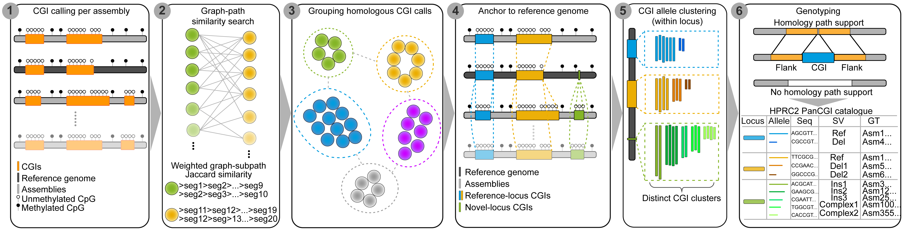
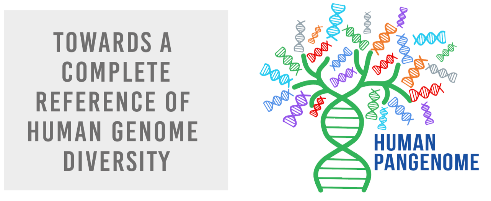

# PanCGI

PanCGI is a pangenome framework for characterizing sequence and presence-absence variation in CpG islands (CGIs). It integrates CGI calls from haplotype-resolved assemblies into homologous loci, resolves sequence alleles within each locus, and genotypes CGI states across haplotypes. The resulting catalogues and genotype matrices support population analyses of CGI polymorphism.

<p align="center">
  
</p>

## Analysis

- **Locus construction:** group homologous CGI calls from different assemblies into a common catalogue.
- **Allele resolution:** cluster CGI sequences within each locus and identify a representative sequence for each allele.
- **Haplotype genotyping:** distinguish CGI presence, CGI absence at a recoverable homologous locus, and missing calls where the homologous locus cannot be resolved.

Each assembly-specific CGI call is a member of an allele at a locus. Output tables link these three levels and retain the assembly coordinates of each member.

## HPRC2 resources

The [HPRC2 PanCGI resource release](https://github.com/tianjie16/PanCGI/releases/tag/resource-v1.0.0) provides:

| Resource | Contents |
| --- | --- |
| Catalogue | 47,039 CGI alleles at 33,463 loci, with assembly-specific members and haplotype membership |
| Sequences | One representative sequence for each CGI allele |
| CGI states | Locus and allele state matrices for 462 HPRC haplotypes, including HG002, and the CHM13 and GRCh38 references |
| Evolutionary trajectories | Trajectory annotations for 2,279 loci |
| CGI calls | Masked and unmasked CGI calls for the 462 HPRC haplotypes |

See the [resource guide](resources/README.md) for file definitions, coordinate conventions and MD5 checksums.

## Installation

PanCGI requires Linux and Python 3.12. To install from source:

```bash
git clone https://github.com/tianjie16/PanCGI.git
cd PanCGI
python3.12 -m venv .venv
source .venv/bin/activate
python -m pip install .
pancgi --version
```

Python packages are installed with PanCGI. Bash and the HAL executables are required to run the pipeline. See the [installation guide](docs/installation.md) for native and Docker-backed HAL execution and a complete example. Packaged software is available from the [software release](https://github.com/tianjie16/PanCGI/releases/tag/v0.1.3).

## Usage

Provide CGI calls for each assembly, a pangenome graph, the corresponding HAL file and per-haplotype insertion/deletion annotations, as specified in the [input formats](docs/inputs.md).

Prepare the assembly and path tables:

```bash
pancgi prepare --gfa graph.gfa --hal alignment.hal \
  --hal-runtime native --out-dir prepared
```

Complete `prepared/mapping/genomes.tsv` with the selected genomes, reference roles and CGI/SV file paths. Complete `prepared/mapping/paths.tsv` with the corresponding graph paths and assembly sequences. Input file paths in `genomes.tsv` are resolved relative to that table or supplied as absolute paths.

Run the analysis:

```bash
pancgi run --prepared prepared --gfa graph.gfa --hal alignment.hal \
  --genomes prepared/mapping/genomes.tsv \
  --paths prepared/mapping/paths.tsv \
  --hal-runtime native --threads 4 --hal-threads 1 --out-dir analysis
```

The [bundled example](docs/installation.md#synthetic-example) provides ready-to-run inputs and expected results.

## Documentation

- [Input formats](docs/inputs.md)
- [Outputs](docs/outputs.md)
- [Computational resources](docs/resources.md)
- [Dependencies](DEPENDENCIES.md)

## Support

Please use [GitHub Issues](https://github.com/tianjie16/PanCGI/issues) for questions and software issues. Include the PanCGI version, command and a small example that reproduces the issue.

## License

Copyright 2026 Tianjie Liu. PanCGI software is licensed under [Apache-2.0](LICENSE). Dependencies retain their respective licenses.

## Related resources

<p align="left">
  <a href="https://humanpangenome.org/">
    
  </a>
</p>

[HPRC resources](https://github.com/human-pangenomics) ·
[HPRC2 study code and resources](https://github.com/tianjie16/HPRC2_DNA_methylome_variation) ·
[Methylation framework](https://github.com/tianjie16/HPRC2_methylation_framework)
